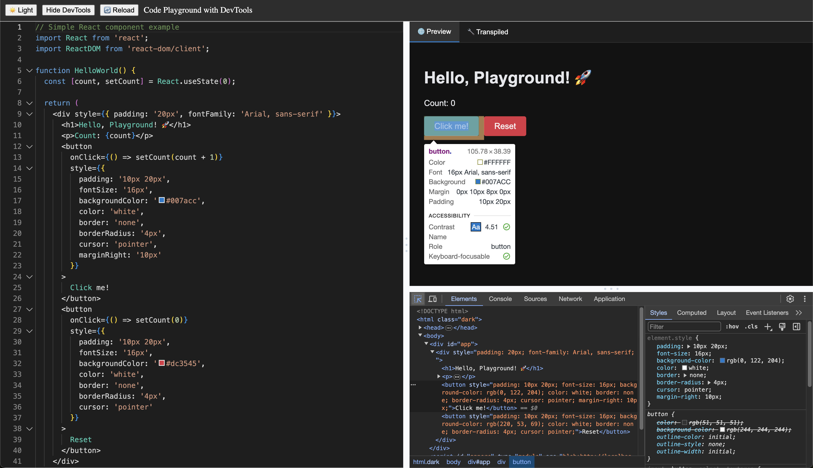

# devtools-frontend-demo

A simple demo of Chrome DevTools Frontend integration with Chobitsu. The purpose is just to understand how coding platform like Codesandbox or StackBlitz can preview code and have their own DevTools to debug it.

<div align="center">
  
</div>

# Setup
First install dependencies:
```
npm install
```

Then start the development server:
```
npm run dev
```